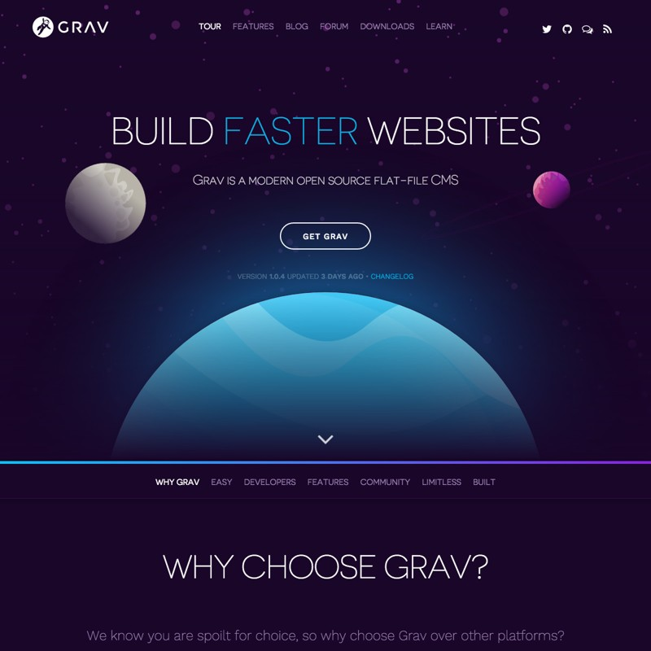

[background=#a1ad36]
[color=#FFF]

## Why Grav?

***

***

## Why I Chose Grav?
* Excellent conceptual/design model
* Markdown/Twig/YAML
* Inherited themes
* Modular (reusable) content
* Custom content types
* Great documentation
* Flat-file CMS

***

## Some Key Benefits of Flat-file CMSs for Educators
* No database means little (or no) IT involvement needed
* Increased portability, as moving a site now only requires simply copying files to another location
* Takes full advantage of the collaborative ecosystem now available (i.e. GitHub, GitLab, etc.)
